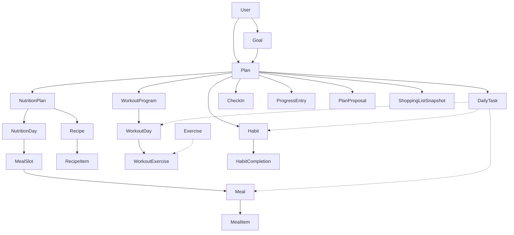

# Domain Model — Planner Integral (Approved)

Canonical ubiquitous language for the Health & Performance Planner.
Approved in Domain Design Phase 1. Implementation of renames/migrations follows [`MIGRATION_PLAN.md`](MIGRATION_PLAN.md).

## Aggregate root

**Plan** is the only execution aggregate root. Everything the user *does* in a block of time hangs off an active Plan.

**Goal** is intention (“why”). **Plan** is the executable strategy (“how, for these N weeks”).

## Entity catalog

### User
- **Responsibility:** Identity and stable preferences (who I am), not the active plan.
- **Relations:** 1→N Goal; 1→N Plan; 1→0..1 ProfileDetails (anthropometrics / activity — today `UserProfile`).
- **Attributes:** id, auth ids (future), timezone, locale; food preferences / exclusions; optional execution mode.
- **Rules:** Multiple Plans allowed; at most one Plan with status `active` (primary).
- **Use cases:** Onboarding, preferences, list plans.

### Goal
- **Responsibility:** Measurable intention (“lose 8 kg”, “run 10k”, “sustain habits”).
- **Relations:** N→1 User; 0..N Plan.
- **Attributes:** type (`deficit|surplus|maintenance|performance|habit_focus|custom`), target_metric, target_value, unit, optional deadline, status.
- **Rules:** No menus or routines inside Goal — only the “what for”.
- **Use cases:** Choose objective → trigger Plan generation (AI / services).

### Plan
- **Responsibility:** Time-boxed executable strategy.
- **Relations:** N→1 User; N→1 Goal; 1→0..1 NutritionPlan; 1→0..1 WorkoutProgram; 1→N Habit; 1→N DailyTask; 1→N CheckIn / ProgressEntry / PlanProposal.
- **Attributes:** name, start_date, end_date, duration_weeks, status (`draft|active|paused|completed`), strategy_notes, enabled_modules flags.
- **Rules:** Activating a Plan pauses/archives the previous active one; delete cascades modules; modules toggled via flags.
- **Use cases:** Create/activate plan; TODAY; weekly review; AI replan.

### NutritionPlan
- **Responsibility:** Nutritional policy for the Plan (targets + distribution).
- **Relations:** 1→1 Plan; 1→N NutritionDay; recipes scoped to plan or user.
- **Attributes:** macro targets; meals_per_day; distribution policy; structured/flexible mode.
- **Rules:** Targets belong to the plan, not a lone calendar day. Legacy `DailyGoal` absorbed here or as derived daily snapshot.
- **Use cases:** Onboarding macros; MacroFactor-like adjust; validate day vs target.

### NutritionDay (ex MealPlan)
- **Responsibility:** Food execution for **one date** inside the Plan.
- **Relations:** N→1 NutritionPlan; 1→N MealSlot → Meal → MealItem.
- **Attributes:** date, optional name, adherence flags.
- **Rules:** Unique `(nutrition_plan_id, date)`; slots 1–4 (or N from NutritionPlan).
- **Use cases:** Build day; summary/validate; feed DailyTask `meal`.

### Meal / MealItem
- **Responsibility:** Concrete meal + ingredients/amounts.
- **Relations:** Meal N→1 MealSlot; MealItem N→1 Meal; optional origin Recipe.
- **Attributes:** macros; items (qty, unit, grams).
- **Rules:** Meal macros are day truth; grams via food catalog.
- **Use cases:** CRUD meal; suggest; shopping aggregation.

### MealSlot
- **Responsibility:** Ordered slot within a NutritionDay (breakfast…dinner). Structural, not a standalone product concept.
- **Relations:** N→1 NutritionDay; 1→N Meal.

### Recipe / RecipeItem (ex MealTemplate)
- **Responsibility:** Reusable library (favorites).
- **Relations:** scope user or plan; instantiated as Meal.
- **Use cases:** One-click into slot; AI-generated recipes.

### ShoppingListSnapshot
- **Responsibility:** Materialized list for a date range (week) for UX / share / offline.
- **Relations:** N→1 Plan; items derived from NutritionDays.
- **Rules:** Regenerable; not pantry stock truth.
- **Use cases:** Compute shopping list + optional “save week”.

### WorkoutProgram
- **Responsibility:** Training program for the Plan.
- **Relations:** 1→1 Plan; 1→N WorkoutDay → WorkoutExercise.
- **Attributes:** name, split, weeks, notes.
- **Use cases:** Generate routine; weekly progression.

### WorkoutDay / WorkoutExercise
- **Responsibility:** Prescribed session and exercises.
- **Relations:** Optional `exercise_id` → Exercise catalog.
- **Attributes:** week_number, day_of_week, name; sets/reps/rest/order/progression_notes.
- **Rules:** Feed DailyTask `workout`.
- **Future:** `WorkoutSession` (actual log) separate from prescribed day.

### Exercise (catalog)
- **Responsibility:** Movement library metadata (muscle, equipment, level).
- **Rules:** Does not store user sets; only catalog.

### Habit / HabitCompletion
- **Responsibility:** Habit definition on the Plan + completion per date.
- **Attributes (Habit):** name, category, frequency, target_value/unit, time_of_day, difficulty, is_active, is_linchpin, non_negotiable_minimum.
- **Rules:** Unique completions `(habit_id, date)`; inactive habits do not spawn new tasks.
- **Use cases:** Add habits; TODAY; streaks/adherence.

### DailyTask
- **Responsibility:** Unified day checklist — **materialized projection** for UX/performance.
- **Attributes:** plan_id, date, title, task_type (`habit|meal|workout|custom`), source_id, completed, order_index, optional scheduled_time.
- **Rules:** Idempotent rebuild from Habits + NutritionDay + WorkoutDay; toggle writes through to source (e.g. HabitCompletion) **via domain service**.
- **Use cases:** `GET /plans/{id}/today`.

### CheckIn
- **Responsibility:** Structured reflection (energy, subjective sleep, negotiations, notes, blockers).
- **Relations:** N→1 Plan; date; period (`daily|weekly`).
- **Distinct from:** ProgressEntry (objective metrics) and DailyTask (actions).
- **Use cases:** Nightly/weekly review; Adaptation / AI input.

### ProgressEntry
- **Responsibility:** Objective measurements over time (weight, measures, adherence_percent, future PRs).
- **Rules:** Does not replace CheckIn; feeds adaptation signals.
- **Use cases:** Charts; macro/volume adjust.

### PlanProposal (ex AIRecommendation)
- **Responsibility:** Versioned change proposal for a Plan (diff JSON: habits ±, macros ±, workout swaps).
- **Attributes:** status (`pending|accepted|rejected`), rationale, payload, created_by (`ai|system|user`).
- **Rules:** Accept applies changes **only through each domain’s services**; never opaque direct mutation.
- **Use cases:** “Travel 5 days”; suggested weekly adjust.

## Explicitly out of core domain

| Candidate | Decision |
|-----------|----------|
| Generic `Workout` | Rejected → WorkoutDay (+ Session later) |
| God-object `Progress` | Rejected → ProgressEntry + projections |
| `Notification` | Infra / integrations |
| Pantry stock | Out of MVP |
| AI chat messages | Out; artifact is PlanProposal |

## Relationship diagram



## Modules (bounded contexts)

```text
services/
  identity/      # User, Profile, preferences
  goals/         # Goal CRUD + intention validation
  planner/       # Plan lifecycle + DailyTask projection + CheckIn
  nutrition/     # NutritionPlan, days, meals, recipes, shopping, suggest
  workouts/      # WorkoutProgram, days, exercise catalog
  habits/        # Habit definitions + completions
  progress/      # ProgressEntry + adherence metrics
  adaptation/    # Weekly rules → PlanProposal (no LLM)
  ai/            # LLM orchestration → PlanProposal
integrations/    # OpenAI, email, push
repositories/    # Data access per aggregate
```

## Layer responsibilities

| Layer | Lives here | Does not live here |
|-------|------------|--------------------|
| **Models** | Shape, simple invariants, ORM relations | Multi-aggregate orchestration, AI calls, build TODAY |
| **Repositories** | Queries/CRUD per aggregate | Rich cross-module side effects |
| **Services** | Use cases: activate plan, rebuild DailyTask, accept PlanProposal, suggest meal | Raw SQL in routes; presentation |
| **Routes/API** | HTTP, edge validation, auth | Domain rules |
| **AI service** | Prompting + parse to PlanProposal | Direct persistence of Meals/Habits |

## Acceptance criteria (Phase 1 design)

1. Plan is the only execution aggregate root.
2. Goal is intention; not mixed with menus/routines.
3. DailyTask is a projection; Habits/Meals/Workouts are source of truth.
4. PlanProposal is the only contract for AI/system changes.
5. A nutrition “day” is not called Plan.
6. Next implementation step: gap closure + migrations per [`MIGRATION_PLAN.md`](MIGRATION_PLAN.md) — not new UI features.
